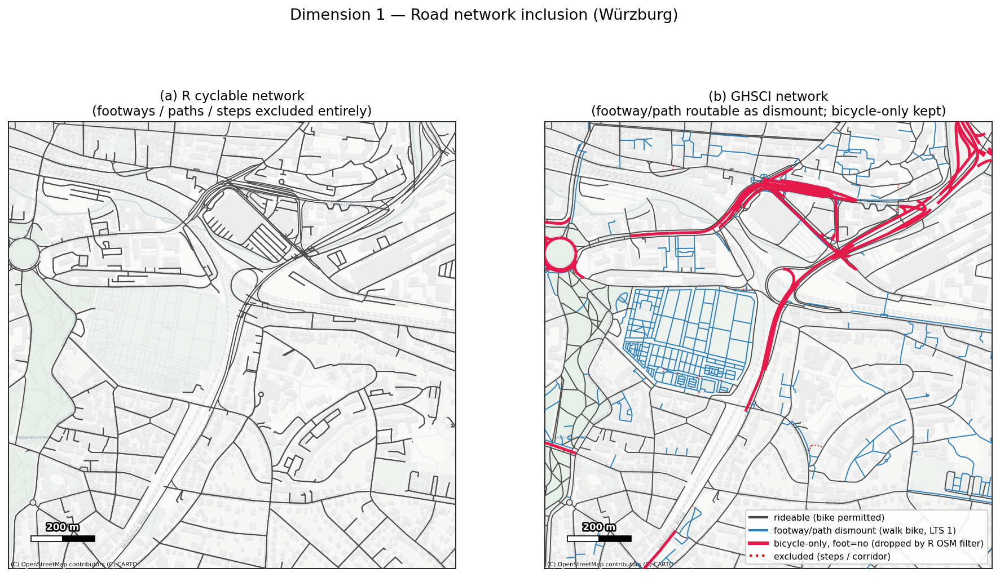
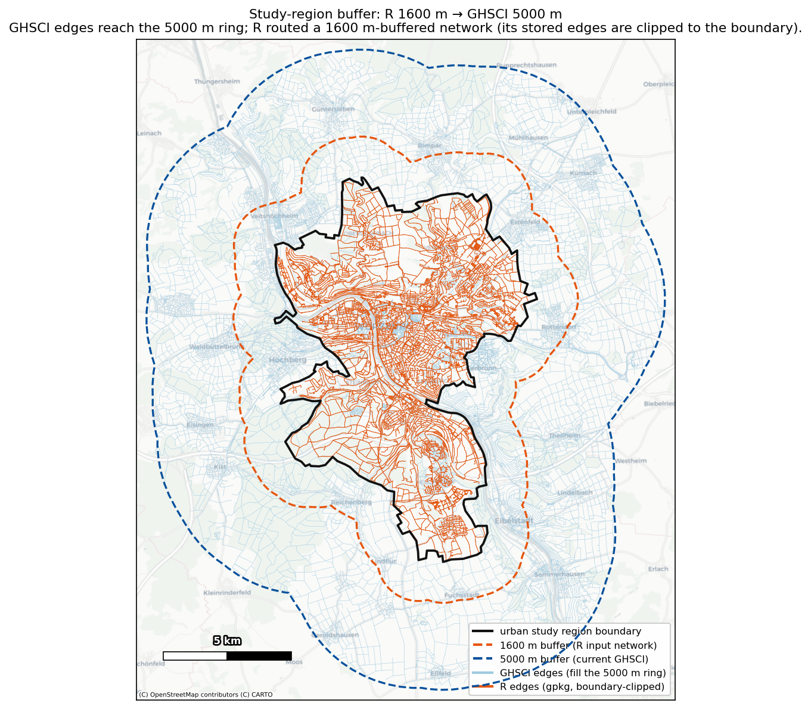
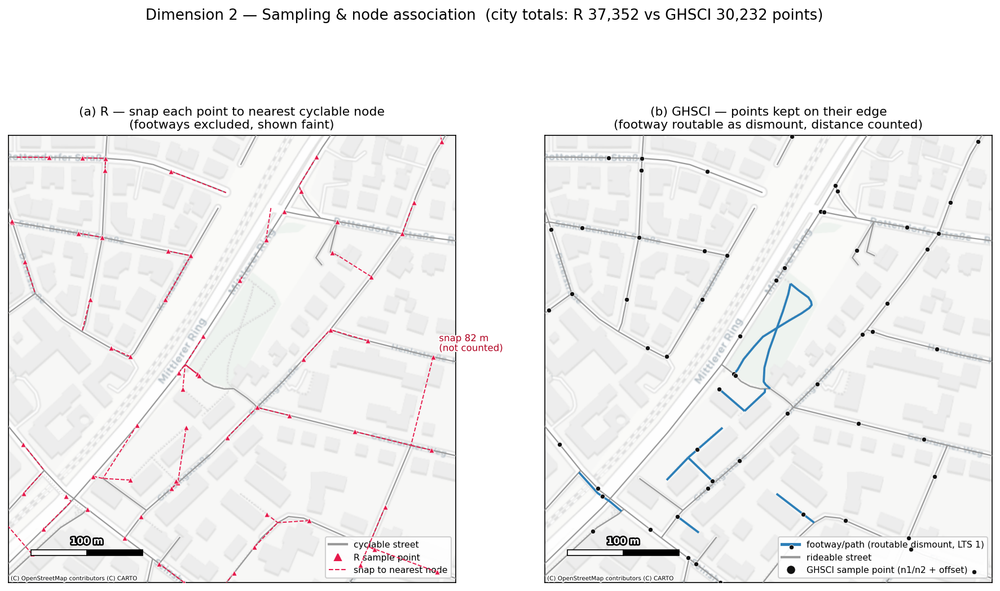
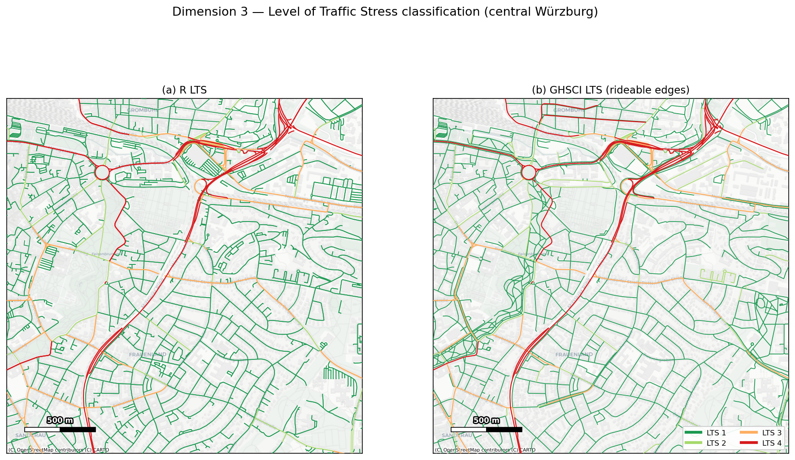
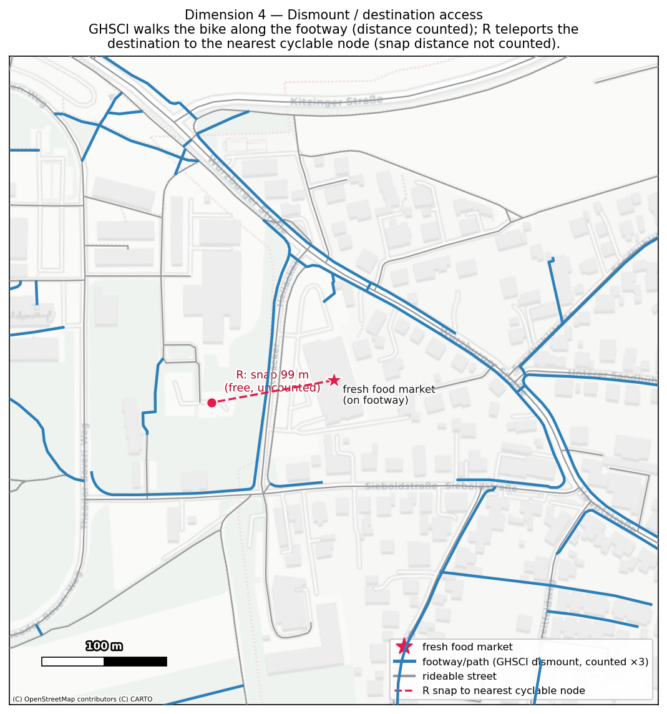
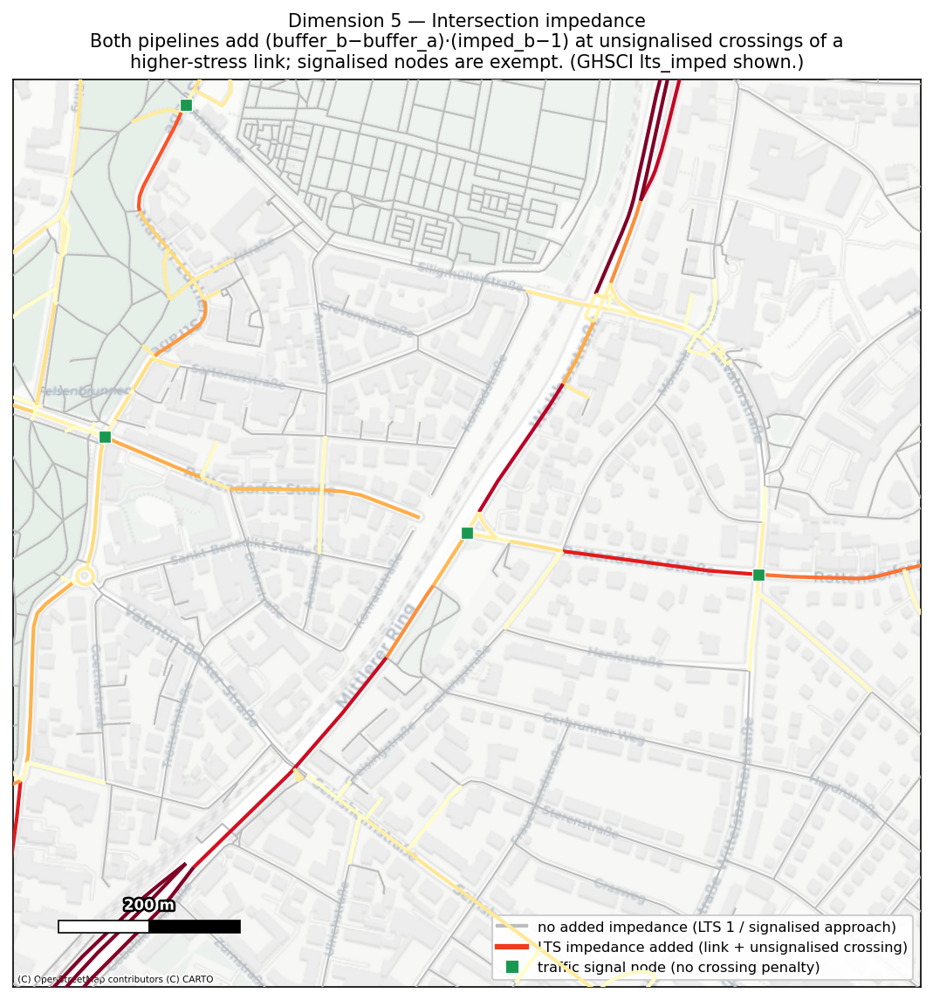
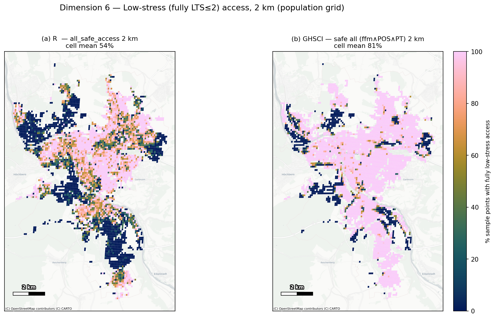
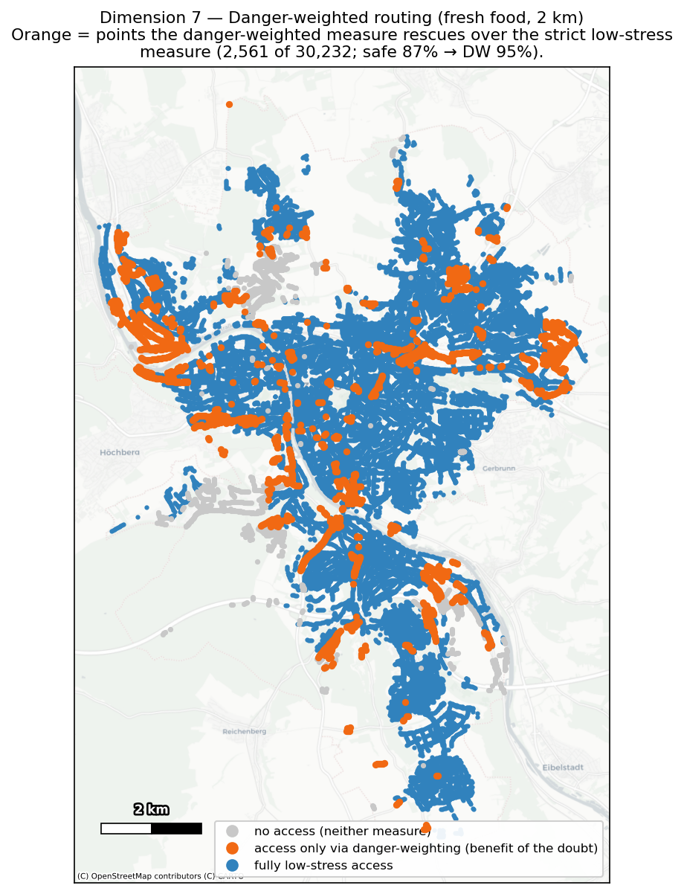

# Cycling accessibility indicators — R (`cyclingIndicators`) vs native GHSCI (`global-indicators`)

**A technical comparison, with a Würzburg case study.**

> CH Note - 2026-07-08: this report and the underlying comparison analysis was generated through a Claude Code (Opus 4.8) session, initiated with the following prompt and followed by iterations and editing: 
> > I want a technical summary of the new GHSCI (global-indicators) cycling indicators (e.g. as run in the ghsci docker container using import ghsci; r = ghsci.Region("data/Cycling/Würzburg/Würzburg.yml"); r.analysis) and how this differs to the previous R implementation.  The R implementation (./cyclingIndicators) used an earlier version of the global-indicators repository to develop its input data (https://github.com/healthysustainablecities/global-indicators/tree/1e6d60e63447ae1d753a608f6371aa7fc22438d9; see https://github.com/healthysustainablecities/global-indicators/blob/1e6d60e63447ae1d753a608f6371aa7fc22438d9/process/build_cycling_indicator_inputs.ipynb).  In particular, I am interested in changes to 1) road network inclusion, 2) sampling strategy, 3) LTS formulation, 4) how dismount rounting/access is handled (eg in the R approach, destinations were snapped to cyclable network -- how far?  how were footpaths handled, and does this differ in GHSCI?), 5) intersections, 6) low-stress access; 7) danger-weighted routing and access.    Wurzberg has been analysed using both approaches (see C:/Users/E33390/OneDrive - RMIT University/GOHSC cycling indicators - General/global-indicators/r_output/Würzburg/Würzburg_cyclingIndicators.gpkg and ghsci database 'würzburg').   I want to include code snippet examples (eg R, Pyhon, SQL) as appropriate, and case study examples (eg annotated maps) from Würzburg that illustrate where and how things are equivalent, and where and how they differ.

This report documents how the **new GHSCI cycling indicators** — the workflow that runs inside the
`global-indicators` Docker container as

```python
import ghsci
r = ghsci.Region("data/Cycling/Würzburg/Würzburg.yml")
r.analysis()          # runs _cycling_lts_network.py then _cycling_accessibility.py
```

differ from the **previous R implementation** in `./cyclingIndicators`. The R pipeline was built on an
*earlier* version of `global-indicators`
([commit `1e6d60e`](https://github.com/healthysustainablecities/global-indicators/tree/1e6d60e63447ae1d753a608f6371aa7fc22438d9),
notebook [`build_cycling_indicator_inputs.ipynb`](https://github.com/healthysustainablecities/global-indicators/blob/1e6d60e63447ae1d753a608f6371aa7fc22438d9/process/build_cycling_indicator_inputs.ipynb)):
it ran the standard GHSCI analysis to produce inputs (network, sample points, destinations), exported
them to GeoPackages, and then did the cycling-specific LTS + accessibility work in R. The new approach
folds all of that into GHSCI itself as two optional subprocess steps.

Both implementations were run for **Würzburg**, so every dimension below is illustrated with a Würzburg
map and Würzburg numbers:

| Source | Artefact |
|---|---|
| R baseline (24 Dec 2025) | `r_output/Würzburg/Würzburg_cyclingIndicators.gpkg` (layers `edges`, `nodes`, `sample_points_accessibility`, `grid_accessibility`) |
| GHSCI (current) | PostGIS database `würzburg` (tables `edges`, `nodes`, `urban_sample_points`, `sample_points_cycling`, `indicators_region`) |

Maps referenced below are in [`cycling_R_vs_GHSCI_maps/`](cycling_R_vs_GHSCI_maps) and were generated by
[`_rq_maps.py`](_rq_maps.py) off the live database and the R GeoPackage.

> **Provenance / authority of this document.** Where the in-repo prose lags the code (the
> `subprocesses/cycling_indicators_readme.md` and some module docstrings still describe an *intermediate*
> design — a single danger-weighted indicator, `dismount_routable` with a 100 m cap, `dismount_weight: 20`,
> `sp_cycle_lowstress_*` naming), this comparison follows the **current code**
> ([`_cycling_lts_network.py`](subprocesses/_cycling_lts_network.py),
> [`_cycling_accessibility.py`](subprocesses/_cycling_accessibility.py)) and the **Würzburg configuration**
> ([`data/Cycling/Würzburg/Würzburg.yml`](data/Cycling/Würzburg/Würzburg.yml)), which produce **two**
> indicator families (a strict fully-low-stress `safe` measure and a danger-weighted `access` measure) with
> uncapped footway dismount at `dismount_weight: 3.0`.

---

## The seven dimensions at a glance

| # | Dimension | R (`cyclingIndicators`) | GHSCI (`global-indicators`) |
|---|---|---|---|
| 1 | **Road network inclusion** | Consumes GHSCI `edges_simplified`; the *old* build applied `["foot"!~"no"]`, dropping bicycle-only paths. Then filters out `no_cycle` classes (incl. footway/path) → a **cyclable-only** network. | `_03` drops `["foot"!~"no"]`, so **bicycle-only (`foot=no`) cyclepaths are kept** (442 segs / 50 km in Würzburg); retains OSM cycle tags; prunes < 15 m dead-end stubs. Footways/paths are kept and flagged. |
| 2 | **Sampling & node association** | GHSCI 30 m sample points (`_07`); each point **snapped to the nearest *cyclable* node** (unbounded, snap distance uncounted). | Same 30 m points; **"full distance"** — matched to the nearest *edge* (`ST_ClosestPoint`) and evaluated from **both** terminal nodes with along-edge offsets (min), for origins *and* destinations. Different point set (30,232 vs 37,352). |
| 3 | **LTS formulation** | `addLTS()` cascade on `cycleway`, `highway`, `maxspeed`, `ADT`; ADT **halved** (one-way edges). | `assign_lts()` — a line-for-line port; ADT **not** halved (undirected) but thresholds un-halved to match → **identical class rules**. |
| 4 | **Dismount / footway access** | Footways/paths/steps **excluded**; origins & destinations snap over them to a cyclable node (distance **not** counted). | Footway/path/pedestrian kept as **`foot_dismount`**, routable at `length × 3` (walk-the-bike, distance **counted**); steps/corridor excluded. |
| 5 | **Intersections** | `LTS_imped` = link term + unsignalised-crossing penalty `(buf_b−buf_a)(imped_b−1)`. | `lts_imped` = identical formula, made **directional** (`to`/`from` node) for forward/reverse cost. |
| 6 | **Low-stress access** | Binary: the danger-weighted-optimal path to a reachable destination is **entirely LTS ≤ 2** (`safe_proportion == 1`). | `safe` measure: shortest **geometric** route over the **LTS ≤ 2 sub-network** within the band (same-component test). Conceptually equal, slightly more complete. |
| 7 | **Danger-weighted routing** | `length_weighted` (LTS 1–2 = length; LTS 3–4 = length × 1.25) used to *select* the path; only the fully-safe result is reported. | Same `cost_lts`, but also **reported as its own indicator** (`access`, "benefit of the doubt") alongside the strict `safe` measure. |

Two **cross-cutting** changes also affect every indicator and are covered inline: the study-region **analysis
buffer grew 1600 m → 5000 m** (§1, *Study-region analysis buffer* — the main reason the GHSCI network is larger
in absolute terms), and the **public-open-space data was corrected** from the *unfiltered* `open_space_areas`
layer (public + non-public, any size, one nearest node per area) to **public** open space at network **entry
nodes** in **any** and **large (> 1.5 ha)** variants (§4, *Destination representation*). Destinations are
measured in strict/lenient pairs throughout — POS *any* + *large*, and, where GTFS exists (Würzburg), PT *any*
+ *frequent* (≤ 20 min headway).

## Headline results (Würzburg)

Share of each pipeline's **own sample points** with access (the like-for-like "distribution" basis — the two
point sets differ, so this is not a per-point join). GHSCI reports two measures; R reports only the strict one.

| Destination (2 km) | R `*_safe_2km` | GHSCI `safe` (fully low-stress) | GHSCI `access` (danger-weighted) |
|---|--:|--:|--:|
| Fresh food market | **63.0 %** | **87.0 %** | 95.4 % |
| Public transport³ | 85.0 % | 95.5 % (any) · 88.5 % (frequent) | 99.5 % |
| Public open space² | 86.3 % | 91.9 % (large) · 93.6 % (any) | 99.2 % |
| All categories¹ | 57.6 % | 82.6 % | 92.4 % |

<sup>¹ R "all" = fresh-food ∧ POS ∧ PT-any. GHSCI `all_strict` = fresh-food ∧ POS-large ∧ **PT-frequent**. On a
*matched* composite (fresh-food ∧ POS-large ∧ PT-any) aggregated to the same population-grid cells, the cell-mean
rises from **R 54 % → GHSCI 81 %** (see Dimension 6).</sup>
<sup>² Not a like-for-like POS definition: R measured access to the **whole `open_space_areas` layer unfiltered**
(public + non-public, any size, one nearest node per area); GHSCI measures **public** open space at **network
entry points**, in **any** and **large (> 1.5 ha)** variants (§4). "Open space" includes squares/plazas, not
only parks.</sup>
<sup>³ Where GTFS is available (Würzburg) GHSCI reports both **any** stop and **frequent** (≤ 20 min average
headway) service; the R row is `pt_any` → GHSCI `pt_any`.</sup>

GHSCI is higher on every comparable indicator. The gap is the compound effect of Dimensions 1, 3, 4 and 7
(larger low-stress network + footway dismount + benefit-of-the-doubt routing), all intended improvements —
not a data discrepancy. GHSCI's **population-weighted** city headline (its official summary,
`indicators_region`) is higher still, because population concentrates in the well-connected core: fresh food
2 km safe **90.9 %** (DW 97.6 %); all-categories 2 km safe **87.1 %** (DW 95.2 %).

---

## 1. Road network inclusion

**Both pipelines get their network from the *same* GHSCI step** — OSMnx extraction + simplification in
[`_03_create_network_resources.py`](subprocesses/_03_create_network_resources.py). The difference is *which*
`_03` and what is kept.

**R (old build).** The `1e6d60e` notebook ran the stock analysis and exported `edges_simplified`. The stock
walking filter contained `["foot"!~"no"]`, so **bicycle-only cyclepaths (`foot=no`) were never pulled from
OSM**. In R, the cyclable network is then formed by dropping non-cyclable classes:

```r
# cyclingIndicators/functions/cyclingIndicatorsWorkflow.R  (Würzburg no_cycle from the driver)
no_cycle <- c("pedestrian", "footway", "steps", "path", "corridor")
edges_cycle <- network_LTS[[2]] %>%
  filter(!(bike_no | highway %in% no_cycle))          # footways/paths excluded outright
```

**GHSCI (current `_03`).** The cycling network filter deliberately **removes** `["foot"!~"no"]` and retains
the OSM cycle tags; a way is dropped only if it is impassable to *both* modes:

```yaml
# process/configuration/config.yml — network_analysis.network
# "for cycling ... we cannot restrict to foot access roads here - some cycle only routes
#  may be accessible by pedestrians"
["highway"]["area"!~"yes"]
["highway"!~"motorway|proposed|construction|abandoned|platform|raceway|emergency_bay"]
["foot"!~"private|destination"]          # note: NO ["foot"!~"no"]
```

```python
# _03_create_network_resources.py
ox.settings.useful_tags_way += ['foot','sidewalk','bicycle','cycleway',
                                'cycleway:left','cycleway:right','maxspeed','motor_vehicle']
...
if foot == "no" and bicycle == "no":     # only remove ways impassable to BOTH modes
    remove_edges.append((u, v, k))
...
prune_short_dangles(G, interval/2)       # drop <15 m dead-end stubs before sampling
```

**Würzburg.** The GHSCI network therefore contains **442 bicycle-only `foot=no` segments (≈ 50 km)** that the
R input network never saw — chiefly the separated cycle tracks running alongside arterials and around
roundabouts. Map 1(b) shows these in **red**; they are simply absent from the R cyclable network in 1(a).
GHSCI also keeps footways/paths (blue) as routable dismount links, and prunes short artefact stubs so sample
points are not stranded on them.



*Equivalent:* same OSMnx engine, same simplification, same 12 m intersection tolerance.
*Different:* GHSCI keeps bicycle-only cyclepaths and footways and prunes sub-sampling stubs; the R input
network excluded them at OSM-extraction and classification time.

### Study-region analysis buffer (1600 m → 5000 m)

A second, orthogonal change to *how far* the network reaches: the GHSCI analysis buffer (`study_buffer` in
`config.yml`, applied around the urban study region to absorb edge effects) was **1600 m** when the R inputs
were built and is **5000 m** now. GHSCI therefore extracts, classifies and routes over a much larger footprint.
This is verifiable straight from the edges: on the same Würzburg boundary the current GHSCI edge set reaches
**5,083 m beyond it** (bounding box 20.2 × 24.8 km), whereas the R GeoPackage edges are clipped to the boundary
(bbox 10.0 × 14.8 km, max 42 m beyond) — the R *routing* network used the 1600 m ring (its
`Würzburg_1600m_buffer.gpkg` provenance). Map 8 overlays the two buffer rings: GHSCI edges fill the 5 km ring
out to the surrounding villages; the R network fills the boundary.



This buffer change — not the classification rules — is the main reason the GHSCI network is so much larger in
*absolute* terms (Dimension 3). It does **not** shift indicator values *inside* the urban area (the wider ring
only prevents under-counting of trips that leave and re-enter near the edge), but it is the correct explanation
for the km totals, and it also means near-boundary R sample points/destinations snapped inward over a clipped
network (a confound to keep in mind when reading any near-edge R result).

---

## 2. Sampling strategy and the "full distance" method

**Both** use GHSCI's `_07_locate_origins_destinations` sample points — vertices every
`point_sampling_interval: 30` m along the network edges. The methodological difference is how a point is tied
to the routable graph.

**R — snap to the nearest cyclable node.** Each origin (and each destination) is moved to the nearest node of
the *cyclable* network; the snap is unbounded and its length is **not** added to any route:

```r
# calculateSamplePointsAccess.R
nodes <- nodes %>%                                   # nodes of the largest cyclable component
  filter(node_id %in% links$from_id | node_id %in% links$to_id)
node <- nodes$node_id[st_nearest_feature(sample_points, nodes)]   # nearest cyclable node
```

**GHSCI — the "full distance" (match to nearest edge + both terminal-node offsets).** GHSCI does **not** snap
to the nearest *node*. Each origin **and** each destination is snapped to the **closest point on its nearest
edge** (`ST_ClosestPoint`); that edge's two terminal nodes `n1`, `n2` are each given an **along-edge offset**
(`n1_distance`, `n2_distance`) equal to the distance from the match point to that node, and the straight-line
offset to the edge is also recorded (`match_point_distance`):

```sql
-- ghsci.add_nearest_node_associations(): associate a point with its nearest EDGE (not node)
match_pt             = ST_ClosestPoint(edge_geom, point)                 -- matched point on the edge
n1_distance          = ST_Length( along edge_geom from n1 to match_pt )  -- along-edge offset to n1
n2_distance          = ST_Length( along edge_geom from n2 to match_pt )  -- along-edge offset to n2
match_point_distance = ST_Distance(point, match_pt)                      -- straight-line offset to the edge
```

Routing evaluates the point from **both** terminal nodes and keeps the minimum. For a sample point,
`create_full_nodes` adds the offset onto each node's destination distance and takes the min; the destination
side is handled identically, so a full origin→destination distance is
`origin_offset + network_path(node → node) + destination_offset` — the **"full distance" method**. The position
*along the edge* is counted for *both* ends of the trip, and nothing is discarded (a point exactly on a node,
`n1_distance == 0`, simply uses that node):

```python
# setup_sp.process_distant_nodes(): add the along-edge offset to each terminal node, then take the MIN
distant_nodes[d] = distant_nodes[d] + distant_nodes['node_distance_m']   # d(node → dest) + offset
# ... aggregated as MIN of the two full distances per sample point
```

So where R keeps a single *nearest node* and throws the offset away, GHSCI keeps a *point on the nearest edge*
and carries the offset to both of that edge's nodes. Because footways are routable (Dimension 4), a point on a
footway is matched to the footway and routes out along it — never teleported. (Dimension 4 illustrates the same
mechanics for a destination.)

**Würzburg.** The point sets differ because the network changed and the points were regenerated:
**R 37,352** vs **GHSCI 30,232** (the drop is mostly dangle-pruning + regeneration). Map 2 contrasts the two
paradigms in a footway-rich block: 2(a) shows R's dashed snap connectors to the nearest cyclable node (one is
82 m — distance that is silently discarded); 2(b) shows GHSCI points staying on their own edges, with the
footways (blue) routable.



*Consequence:* R's free snap can **flatter** access (a point deep in a footway pocket teleports onto the
cyclable network for nothing) but can also **strand** it if the nearest cyclable node is across a barrier;
GHSCI instead pays an honest (penalised) walked distance to leave the footway.

---

## 3. LTS formulation

The Level-of-Traffic-Stress classification is a **direct port**. The R cascade
([`addLTSAssumedTraffic.R`](../../cyclingIndicators/functions/addLTSAssumedTraffic.R)) and the Python cascade
([`_cycling_lts_network.py :: assign_lts`](subprocesses/_cycling_lts_network.py)) apply the same
first-match-wins rules on `bike_facility`, `highway`, `maxspeed` and assumed `ADT`.

```r
# R — addLTS(): note ADT halved because the network is modelled one-way
ADT = case_when(highway %in% local ~ 750/2, tertiary ~ 3000/2, secondary ~ 10000/2)
lvl_traf_stress = case_when(
  cycleway %in% c("bikepath","shared_path")                       ~ 1,
  highway %in% c("cycleway","track","pedestrian","footway",
                 "path","corridor","steps")                       ~ 1,
  cycleway=="separated_lane" & speed<=50                          ~ 1,
  highway %in% local & ADT<=2000/2 & speed<=30                    ~ 1,
  ... TRUE ~ 4)
```

```python
# Python — assign_lts(): ADT NOT halved (undirected); thresholds un-halved to match => identical
ADT_BY_GROUP = {'local': 750.0, 'tertiary': 3000.0, 'secondary': 10000.0}
conditions = [
  facility.isin(['bikepath','shared_path']),
  highway.isin(OFFROAD),                                    # cycleway/track/…/footway/path/steps
  (facility=='separated_lane') & (speed<=50),
  highway.isin(LOCAL) & (adt<=2000) & (speed<=30), ...]
choices = [1,1,1,1,1, 2,2,2,2,2,2, 3,3,3,3]                 # default 4
```

The one-way/undirected difference cancels exactly (R halves both the ADT *and* the thresholds; GHSCI halves
neither), so LTS results are unchanged. `bike_facility` is classified identically (R `createCycleway` →
Python `classify_cycleway`), including `cycleway` precedence and the `motor_vehicle`-restricted-as-local rule.

**Würzburg.** Class *shares* are essentially the same on very different network *extents*:

| | R cyclable network | GHSCI rideable network |
|---|--:|--:|
| Total length | 2,039 km (30,084 edges) | 3,559 km (32,696 edges) |
| LTS 1 | 1,728 km (84.7 %) | 2,903 km (81.6 %) |
| LTS 2 | 94 km (4.6 %) | 313 km (8.8 %) |
| LTS 3 | 98 km (4.8 %) | 103 km (2.9 %) |
| LTS 4 | 120 km (5.9 %) | 240 km (6.7 %) |
| **LTS ≤ 2 (low-stress)** | **1,821 km (89.3 %)** | **3,216 km (90.4 %)** |

The **share** of low-stress network is near-identical (≈ 89–90 %); the **absolute** low-stress network is much
larger in GHSCI (+ ~77 %) because it includes the bicycle-signed footways/paths and `foot=no` cycle tracks R
dropped (Dimension 1) and spans the far larger **5000 m** analysis buffer vs **1600 m** for the R inputs (see
the *Study-region analysis buffer* note in §1).



Map 3 shows the stress pattern is **broadly similar** street-by-street — arterials red (LTS 4), collectors
orange (LTS 3), residential/greenway green (LTS 1) — but **not identical**: a few streets read high-stress in
GHSCI yet low-stress in R. Checking the central window, **none of the GHSCI high-stress edges are truly missing
from R** (0 with no co-located R edge); the ~7 km of difference are **reclassifications of the same streets**,
from two network-build differences (not the LTS rules, which are identical):

- **Separated cycle tracks are now their own edges (Dimension 1).** Where an arterial has a parallel cycle track
  (`cycleway:right=track`), GHSCI keeps the **track as a distinct LTS 1–2 edge** and scores the **carriageway on
  its own merits (LTS 3–4)** — so the map shows a *red carriageway + a green parallel track*. R's coarser, older
  network more often folded that track tag onto the carriageway edge, scoring the whole street LTS 1 (green).
  This is the two red arterials that stand out in GHSCI — e.g. **Nordtangente / Europastern** — where R shows one
  green line.
- **`busway` is kept by GHSCI but dropped by R.** A bus road such as **Petrinistraße** is a rideable LTS 4 edge
  in GHSCI, whereas R's workflow explicitly filters out `busway` (with `bus_stop`, `elevator`, …), so R shows
  only the parallel residential/service streets (green) and no red busway.

GHSCI's split is arguably the more faithful picture — the carriageway genuinely is high-stress, and the safe
route is the separate track (which GHSCI also carries).

*Equivalent:* the LTS decision table, facility classification, speed defaults (layered, not replaced), and
impedance constants. *Different:* network extent, and — at a handful of streets — how each build attributes
cycle tracks and which edge classes it keeps (above), not the LTS rules.

---

## 4. Dismount routing / destination access

This is the largest methodological change, and it answers the specific questions:

**How were footpaths handled in R, and how far did snapping reach?**
In R the cyclable network **excludes** footway/path/pedestrian/steps/corridor entirely (they are in
`no_cycle`), so riders never traverse them. Both **origins and destinations are snapped to the nearest cyclable
node** with `st_nearest_feature` — an **unbounded** nearest-neighbour whose length is **discarded** (never added
to the route). A shop fronting a footway is therefore relocated onto the nearest cyclable *road* node for free.
Snap distances are small in the dense grid but grow wherever the cyclable network is sparse — deep in a
pedestrianised zone, or (a confound) near the clipped study-region edge.

```r
# calculateSamplePointsAccess.R — destinations snap to the nearest cyclable NODE, unbounded, uncounted
snap_to_nodes <- function(x, ...) {
  idx <- sf::st_nearest_feature(x, node_geom)         # nearest cyclable node; distance discarded
  data.frame(dest_node = node_geom$node_id[idx], ...) }
```

**GHSCI — full distance + dismount, walked and counted.** GHSCI applies the **full-distance** method of
Dimension 2 to destinations as well: a market is matched to the **closest point on its nearest edge** and
reached via that edge's two terminal nodes with along-edge offsets — no node snap, nothing discarded. And
footway/path/pedestrian ways are kept as **`foot_dismount`**: not rideable, but walkable and routable at
`length × dismount_weight` (default **3.0**, ≈ walking 5 km/h vs cycling 15 km/h); steps and corridors stay
excluded. So a footway-side destination is reached by walking the bike along the footway, distance counted.

```python
# _cycling_lts_network.py
DISMOUNT_HIGHWAYS = ['footway','path','pedestrian']     # steps/corridor excluded
def compute_foot_dismount(edges):
    return (~edges['bike_permitted']) & edges['highway'].isin(DISMOUNT_HIGHWAYS) & (~barred)
edges['cost_dist'] = np.where(dismount, length * dismount_weight, length)   # walked footway ×3
```

An explicit `bicycle ∈ {yes,designated,official}` **overrides** the class ban (a German shared foot/cycle path
is bikeable), so many footways are `bike_permitted` rather than dismount.

**Würzburg.** Of 43,526 edges: **32,696 rideable**, **10,288 walk-the-bike dismount** (5,801 footway + 3,529
path + …), and **542 fully excluded** (steps/corridor). Map 4 takes a fresh-food market in the pedestrianised
old town (Marktplatz), 2.2 km inside the boundary (so no clip confound): **(a)** R, which excludes those
pedestrian ways, snaps the market **65 m** to the nearest cyclable *road* node and discards that 65 m — the R
cyclable network (orange) is visibly sparse across the pedestrian core; **(b)** GHSCI matches it to its nearest
edge — a **4 m** match — and routes via that edge's two terminal nodes (offsets **18 m / 6 m**), continuing over
the fine-grained footway network. Here neither network has a rideable street much nearer, so the driver is R's
*node snap of a footway-embedded destination*, not a closer GHSCI street.



*Different:* R excludes footpaths and reaches footpath-side destinations by discarding an unbounded snap to the
nearest node; GHSCI matches to the nearest edge (full distance) and walks footpaths at a counted penalty —
both **more complete** (nothing stranded) and **more honest** (the match offset and the dismount walk are
charged).

### Destination representation — public open space (a data correction)

The destination *data* also changed, most consequentially for **public open space (POS)** — which here means
any public open space (squares, plazas, greens…), **not only parks**. The R code used the entire
`open_space_areas` layer read *unfiltered* — every "area of open space" (4,448 of them in Würzburg,
MultiPolygons), with no `aos_ha_public` (public) filter and no size filter; each area was snapped
to its single nearest cyclable node:

```r
# calculateSamplePointsAccess.R (main branch) — ALL open space areas, no public/size filter
destinations_spaces <- st_read(POIs, layer = "open_space_areas")          # 4,448 AOS polygons
pos_df <- destinations_spaces %>% transmute(dest_id = paste0("pos_", aos_id),
                                            dest_type = "public_open_space")   # unfiltered
nearest_node_id <- nodes$node_id[st_nearest_feature(destination_cycling, nodes)]  # 1 nearest node / area
```

So the R baseline (a) included non-public open space (areas with `aos_ha_public = 0`) and were of any size (down
to ~1 m²), and (b) snapped each area to one nearest network node — closer to a centroid-style single access
point.

The GHSCI implementation corrects this approach. POS is taken from the public AOS layers at their network entry points — every node
within 30 m of the publicly-accessible part of the area, so access is measured to plausible entrances — and in two variants: any public open space (`aos_public_any_nodes_30m_line`) and large
(> 1.5 ha, `aos_public_large_nodes_30m_line`). In Würzburg the large layer alone is 18,241 entry nodes. This
public / entry-node correction — as much as the routing changes — is why the R and GHSCI POS figures are not a
like-for-like count, and it is a genuine data-quality improvement, not only a methodological one.

---

## 5. Intersections

**Both** implement the manuscript's two-component LTS impedance (§2.2): a **link** term from the segment's own
stress plus an **intersection** term for crossing into a higher-stress *unsignalised* node. The per-LTS buffer
distances `{1:0, 2:5, 3:10, 4:25}` m and multipliers `{1:1, 2:1.05, 3:1.10, 4:1.15}` are identical.

```r
# addLTSAssumedTraffic.R — unsignalised crossing of the highest-LTS link 'b' at the to-node
intersec_imped = ifelse(is.na(type) | type != "traffic_signals",
                        (buffer.b - buffer.a) * (imped.b - 1), 0)
LTS_imped = (length * (imped.a - 1)) + intersec_imped     # link term + crossing term
```

```python
# _cycling_lts_network.py — same formula; made directional for forward/reverse routing cost
penalty = np.where(signalised, 0.0, (buffer_b - buffer_a) * (imped_b - 1.0))
link_imped = length * (imped_a - 1.0)
edges['cost_lts']         = weighted_length + link_imped + to_penalty     # enter the 'to' node
edges['cost_lts_reverse'] = weighted_length + link_imped + from_penalty   # enter the 'from' node
```

The only refinement is that GHSCI keeps the crossing penalty **directional** (which node you enter) so the
undirected router can use the correct penalty in each direction; R, being one-way-expanded, carried a single
`to`-node penalty per directed edge — the same information. Untagged nodes count as unsignalised in both.

**Würzburg.** 31,152 nodes, of which **106 are `traffic_signals`** (penalty-exempt). Map 5 colours edges by
`lts_imped`: the arterial ring carries high impedance (long LTS 3–4 links plus unsignalised crossings), while
signalised junctions (green squares) add no crossing penalty.



*Equivalent:* formula, constants, signal exemption. *Different:* directional bookkeeping only.

---

## 6. Low-stress access

Both report the manuscript headline — *can you reach the destination by an entirely low-stress (LTS ≤ 2)
route within the distance band?* — but compute it differently.

**R.** For each origin–destination pair reachable within the **geometric** threshold (`pgr_dijkstraCost` on
`length`), route once on the danger-weighted cost, then test whether **that** path is entirely LTS ≤ 2:

```r
# calculateSamplePointsAccess.R
safe_length     = ifelse(lvl_traf_stress %in% c(1,2), length, 0)   # per edge on the chosen path
safe_proportion = safe_length / length
dest_safe       = uniqueN(dest_id[safe_proportion == 1])           # fully low-stress route exists
```

**GHSCI.** Route the **geometric** shortest path over the **LTS ≤ 2 sub-network only**, and require the origin
and the destination's access node to lie in the same low-stress connected component:

```python
# _cycling_accessibility.py
SAFE_WHERE = 'lvl_traf_stress <= 2 AND (bike_permitted OR foot_dismount)'
DIST_COST  = 'cost_dist'         # geometric metres (footway dismount ×3)
# safe measure routed over SAFE_WHERE on cost_dist, banded {500,1000,2000,5000}
```
```sql
-- build_safe_components(): two nodes share a component iff a fully-LTS<=2 route connects them
SELECT "from" AS u, "to" AS v FROM edges WHERE lvl_traf_stress<=2 AND (bike_permitted OR foot_dismount);
```

These are conceptually the same test. GHSCI's is slightly **more complete**: R only checks whether the
*danger-weighted-optimal* path happens to be fully safe, so it can miss a fully-low-stress route that exists but
is not the danger-weighted shortest; GHSCI searches the low-stress sub-network directly. Together with
Dimensions 1/3/4 this is why GHSCI's safe access is higher.

**Würzburg.** Map 6 puts the two on the *same* population-grid cells with a *matched* composite (fresh-food ∧
POS-large ∧ PT-any, fully low-stress, 2 km): cell-mean **R 54 % → GHSCI 81 %**. The uplift is concentrated in
the connected core; the peripheral valleys stay low in both. (The composite's POS term is not a like-for-like
definition — R's unfiltered whole-area nearest-node vs GHSCI's public entry nodes, §4 — so part of this gap is
the POS data correction, not only the routing.)



---

## 7. Danger-weighted routing and access

The danger weighting itself is **identical**: low-stress links cost their length, high-stress (LTS 3–4) links
cost `length × 1.25`, plus the §2.2 impedance — so routes prefer low-stress paths but can use a stressful link
where connectivity demands it.

```r
# calculateSamplePointsAccess.R
length_weighted = ifelse(lvl_traf_stress %in% c(1,2),
                         length + LTS_imped,
                         (length * denger_weight) + LTS_imped)   # denger_weight = 1.25
```
```python
# _cycling_lts_network.py :: add_impedance   (DANGER_WEIGHT = 1.25)
base_danger     = np.where(edges['lvl_traf_stress'].isin([3,4]), danger_weight, 1.0)
weighted_length = np.where(dismount, length*dismount_weight, length*base_danger)
edges['cost_lts'] = weighted_length + link_imped + to_penalty
```

The **difference is what is reported.** In R, danger-weighting is only a *path-selection device*: it picks the
route, and then only the strictly-fully-safe outcome becomes an indicator. GHSCI keeps that strict `safe`
indicator **and** additionally reports the danger-weighted result as its own **`access`** ("benefit of the
doubt") indicator — a destination is accessible if a route within the danger-weighted budget exists, even if it
uses a short penalised LTS 3–4 hop. This rescues origins that sit just off the low-stress network (an amenity
fronting an arterial; a point on an LTS 3–4 junction) without hand-waving the stress away.

**Würzburg.** For fresh food at 2 km, the strict measure gives 87.0 % of points access; the danger-weighted
measure lifts this to 95.4 %. Map 7 shows the **2,561 points (orange)** that only the danger-weighted measure
reaches — they line the arterials and the urban edge, exactly where a fully-low-stress route falls just short.



GHSCI also runs this band-by-band ({500, 1000, 2000, 5000} m) and over an exact in-process Dijkstra engine
(`routing_engine: inmemory`, equivalence-gated against pgRouting), where R looped `pgr_dijkstra` over spatially
buffered clusters of points:

```sql
-- R: geometric reachability then danger-weighted path, per point cluster, in PostGIS/pgRouting
SELECT * FROM pgr_dijkstraCost('SELECT id,source,target,length AS cost FROM cluster_edges',
                               ARRAY[...sources], ARRAY[...targets], directed => false);   -- gate
SELECT * FROM pgr_dijkstra    ('SELECT id,source,target,length_weighted AS cost FROM cluster_edges',
                               ARRAY[...], ARRAY[...], directed => false);                 -- path
```

---

## What GHSCI adds beyond the R set

Because the destination "specs" are configurable, GHSCI produces indicators R never had, at no extra modelling
cost:

- **Strict *and* lenient variants** per category (fresh-food strict vs fresh-food + convenience; POS > 1.5 ha
  vs any POS; frequent PT ≤ 20 min headway vs any PT), and a bakery-excluded food sensitivity.
- **Composite "all categories" indicators** per variant (`all_strict`, `all_lenient`).
- **Activity centres** — network nodes whose 400 m pedestrian walk-shed contains *every* category, in a
  `local` (everyday) and `complete` (high-amenity) tier, then measured like any destination.
- **Four distance bands** (500/1000/2000/5000 m) rather than 2 km/5 km, and a **distance-to-nearest** metre
  value per destination (`sp_cycle_[safe_]nearest_node_*`) alongside the binary.
- **Population-weighted city summaries** and grid columns emitted straight into the standard GHSCI
  `indicators_region` / grid tables.

---

## Reproducing this comparison

Inside the running `ghsci` container (`ghsci` + `ghscic_postgis` up):

```bash
# LTS network + accessibility for Würzburg (already run for the DB used here)
docker exec ghsci /env/bin/python subprocesses/_cycling_lts_network.py   "data/Cycling/Würzburg/Würzburg"
docker exec ghsci /env/bin/python subprocesses/_cycling_accessibility.py "data/Cycling/Würzburg/Würzburg"

# regenerate the seven maps (reads the würzburg DB + r_output gpkg)
docker exec ghsci /env/bin/python process/_rq_maps.py            # all 7, or e.g. `... _rq_maps.py 4`

# distributional R-vs-Python indicator comparison
docker exec ghsci /env/bin/python process/compare_cycling_r_python.py "data/Cycling/Würzburg/Würzburg" \
    --r-gpkg /home/ghsci/r_output/Würzburg/Würzburg_cyclingIndicators.gpkg --distribution-only
```

Key files: [`subprocesses/_cycling_lts_network.py`](subprocesses/_cycling_lts_network.py),
[`subprocesses/_cycling_accessibility.py`](subprocesses/_cycling_accessibility.py),
[`data/Cycling/Würzburg/Würzburg.yml`](data/Cycling/Würzburg/Würzburg.yml);
R reference [`cyclingIndicators/functions/`](../../cyclingIndicators/functions).
