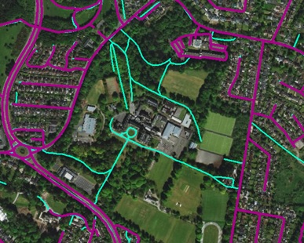
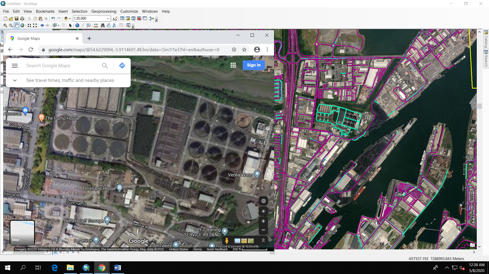
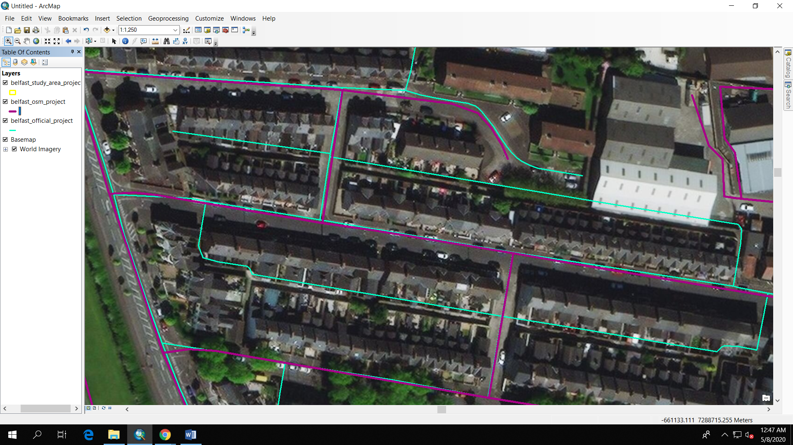
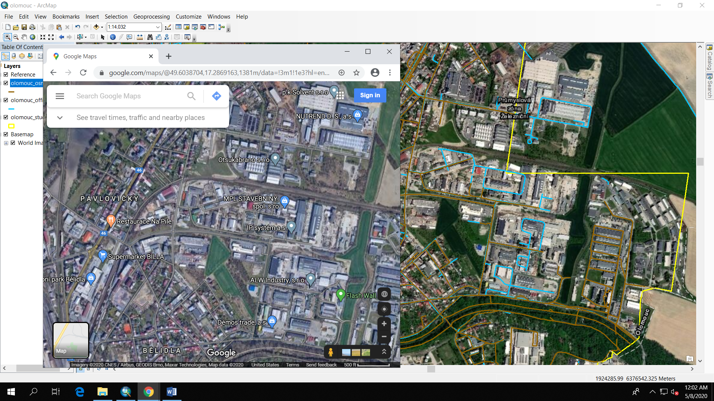

#Street Network Validation – Preliminary Result

Street networks obtained from OSM for three cities of Olomouc, Belfast, and Hong Kong are validated against the ones given by official collaborators from each city. 

The extent of the networks for validation is within the study area used by the project. 

Table 1 shows the networks from OSM and official networks for the three cities. For all three cities, OSM network tends to be denser. This is expected since OSM does include pedestrian paths. The official data might focus more on the major roads/street. Among the three cities, the difference between OSM and official networks are more visible in Hong Kong, an Asian city. Belfast and Olomouc are two European cities. European cities might collect more and make more of their data available for public. 

**Table 1: OSM and Official Street Network in three cities**

Total length of each network as well as number of segments are calculated to have a better comparison (Table 2). The total length of official dataset in Hong Kong is only about 40% of the OSM one. It is 40.3% in Olomouc and 78.2% in Belfast. The 2 datasets in Belfast are more similar than those in the other two cities. Similar pattern can be seen in the number of segments of the networks. Number of segment in official networks is about 71% of that of OSM network in Belfast. The number in Olomouc (29.2%) and Hong Kong (26.7%) are much lower. 

**Table 2: Results from comparing OSM and Official networks**

We are interested in what type of areas where OSM and official datasets are different. Most importantly, in what area, OSM is missing a feature that are available in the official dataset. In order to do this, we overlay OSM network on top of the official one and investigate the gap in OSM network allowing feature from the official layer to be seen. The areas where the gaps happen are reviewed in Google Street map as well as Bing map in order to see the type of areas that OSM tends to miss. The findings are explained below. 

##Belfast: 
For Belfast, similar to the idea given by overviewing the network maps as well as calculating the rough number of network segment and total length, the OSM and official datasets are quite close. There are however, some small and disperse places where OSM network misses the feature available in the official one. Most of the missing features are internal network (of a property) Most of those places fall under these categories:

Places with lots of trees such as park: Figure 1 shows a castle with which OSM network misses all the paths within the property (in bright green). 

**Figure 1: Paths within a castle (in bright green)**

Industrial area: In figure 2, all the paths within a water plant (Veolia water) are missing in OSM street network. 

**Figure 2**

Internal network within residential areas: In Figure 3, OSM network misses the features within some residential areas. 

**Figure 3**

##Olomouc:
There are more gaps in OSM network in Olomouc than in Belfast. Moreover, the gaps are less scattered. They tend to cluster in the fringe area (Figure 4). 

Zooming more closely into these areas, we can see that most of them are internal network within industrial areas (blue lines in Figure 5)

**Figure 5: Internal network in industrial areas**

##Hong Kong:
