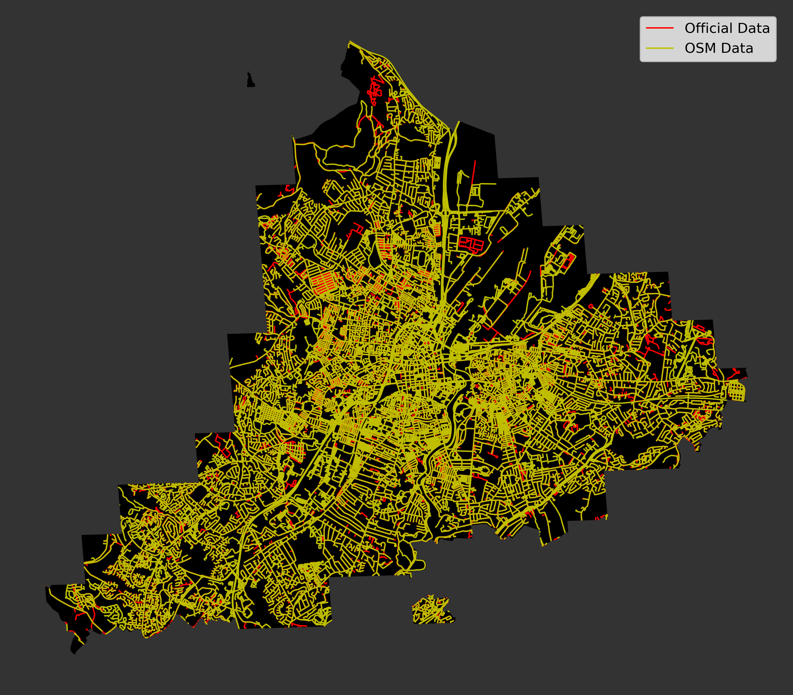
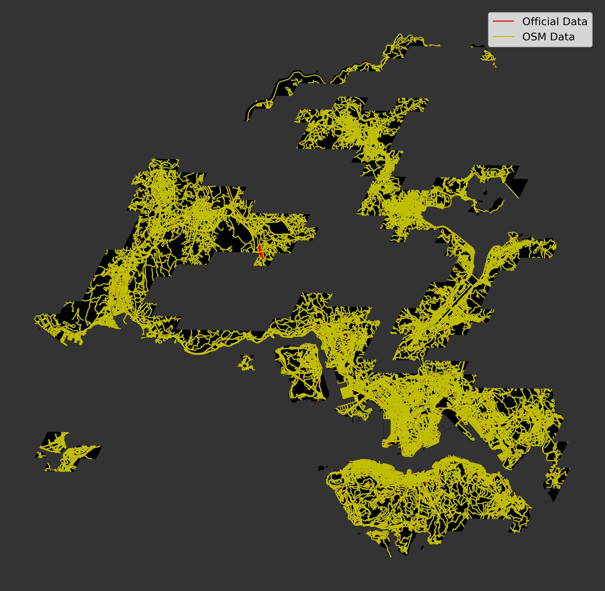
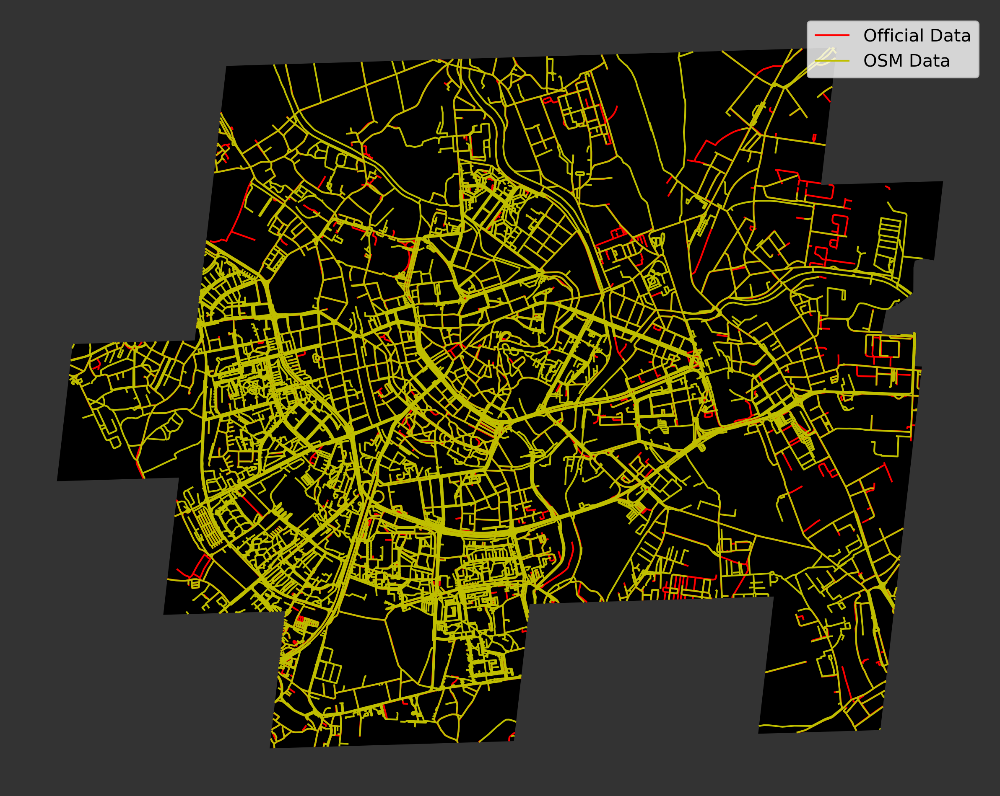
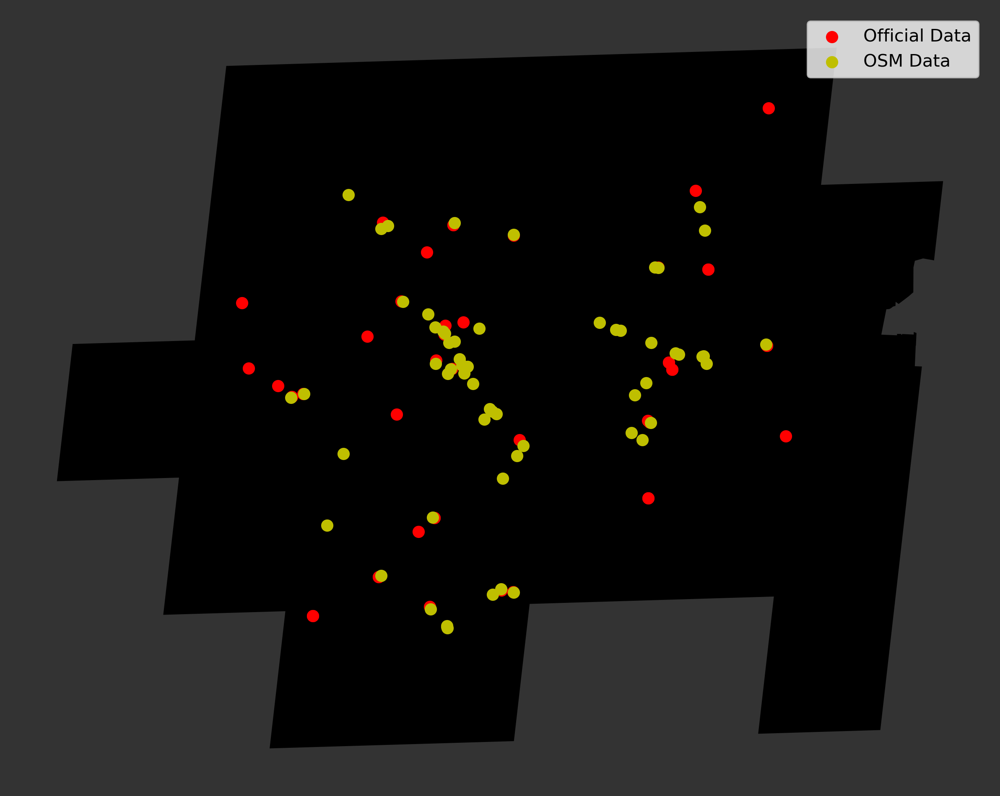
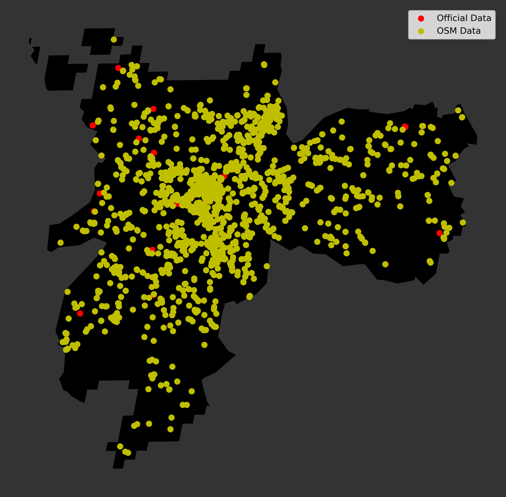
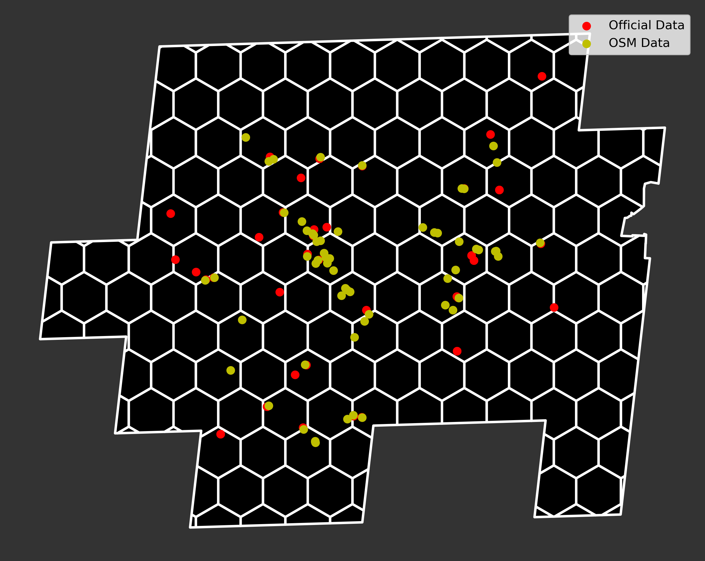
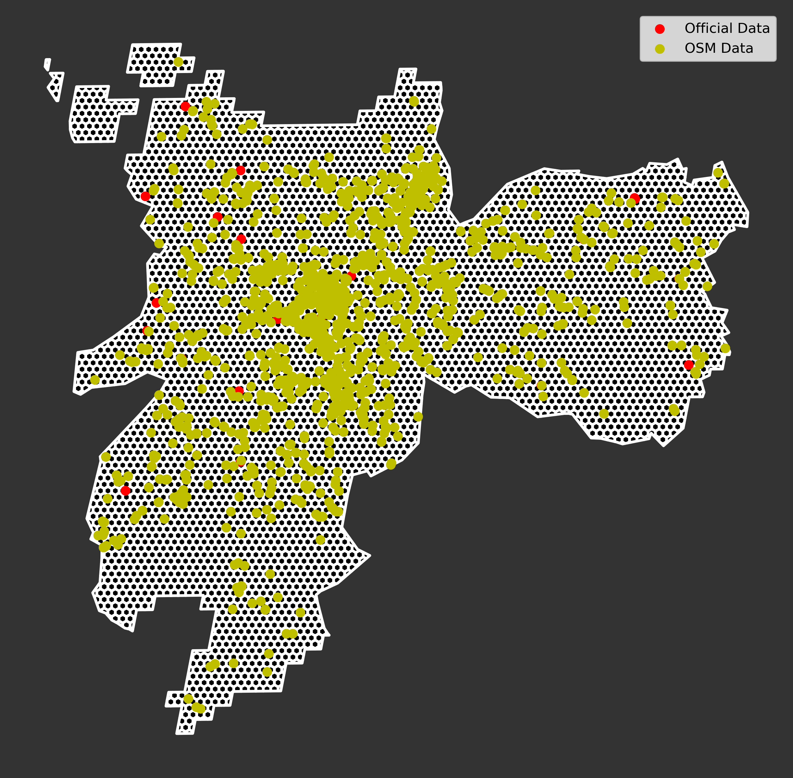

# Geospatial Team Phase II Validation Report

This report summarizes the Phase II validation efforts by the global indicators geospatial team. It includes a short lit review summarizing the state of the field in validating OpenStreetMap data, an overview of the team's overall validation motives and logic, and our computational methods. Finally it presents and discusses the validation findings, comparing OpenStreetMap data to official data sets from city partners in the context of how they are used to compute global indicators. While the open data unsurprisingly diverge from the official data in various ways, their overall correspondence is high and sufficient for the purposes of calculating the global indicators.

## Literature Review

Over the past decade, the emphasis of the internet transitioned from users consuming predefined content to users simply contributing and sharing content (O’Reilly 2005). When working with geodata, quality is often defined by pre-established parameters compiled over the years. In the field of geo-information, the principles of the International Organization for Standardization are taken as a standard of quality assessment. 

The OpenStreetMap Project (OSM) emerged from this growing emphasis on user-generated content. OSM is a system based on volunteered geographic information (VGI). However, the quality of spatial data provided is often questioned (Girres and Touya 2010). Thus far, OSM has produced a large amount of spatial data. However, most of OSM’s contributors are volunteers or aficionados from diverse backgrounds. Many of those contributors lack training in geographical information science standards and methods. This leads to concerns regarding the data quality (Singh Sehra et al. 2020). Numerous scientific studies focused on evaluating OSM data quality. Over time, various approaches have been developed as technological advancements provided new tools producing more complex quality assessment methods. 
 
OSM started in London in August of 2004. One early study by Haklay (2010) utilizes London (metropolitan area) and England (country area) as its study areas. The research focused on analyzing its quality through a comparison with Ordinance Survey datasets. An evaluation of the positional accuracy, attribute accuracy, completeness, and consistency provided an early indication of the quality of VGI. 

For this study, two elements of the possible range of quality were measured: positional accuracy and completeness. For comparison, only streets and roads were used. These are the main features collected by OSM volunteers. Junctions were collapsed to single nodes and multi-carriageways to individual links. High-resolution mapping (1:1250 urban areas, 1:2500 in rural areas, 1:10 000 in moorland), avoiding minor roads and cul-de-sacs. A grid at a resolution of 1 km was created across England. The rest of the analysis was carried out through SQL queries, which added up the length of lines that were contained in or intersected the grid cells. The results demonstrated VGI was able to reach very good spatial quality. However, the inconsistency of VGI in terms of quality demonstrated the digital and social divide of VGI. Rural areas and poorer areas evidenced a lack of coverage (Haklay 2010).
 
In order to assess the completeness of OSM data, a visual comparison with aerial imagery, and fitting parametric models regarding the historical growth of the OSM street network was presented in 2017 by Barrington-Leigh and Millard-Ball. Their study found that globally, OSM is 83% complete, and more than 40% of countries have fully mapped street networks. The most notable finding is that completeness has a U-shaped relationship with density. Inter-urban roads that traverse areas with minimal population are primarily present in OSM and high-density regions with a large number of contributors. Communities that are most likely to have missing streets are smaller towns and villages. After obtaining estimates of completeness, the length of the road network in each country was obtained by dividing the existing length of mapped roads in OSM by the estimated fraction complete. The visual assessment was based on a stratified and probability-weighted sample of 45 points in each country. The sampling algorithm in QGIS selected a random point and overlays streets in the OSM database against aerial or satellite imagery provided by Google through the OpenLayersplugin, at a scale of 1:5000. The model also provided estimates of the number of road edges, which were then used to weight each grid cell when aggregating the grid-cell fraction complete predictions to the country level (Barrington-Leigh and Millard-Ball 2017). 
 
Extending the previous work by Haklay (2010), an article that studies the quality of French OpenStreetMap data provides a larger set of spatial data quality element assessments and uses different quality control methods. Comparisons were made between the OSM data and BD TOPO Large Scale Referential (RGE) data (reference datasets with a metric resolution). These were used to assess: geometric accuracy; attribute accuracy; completeness; logical consistency; semantic accuracy; temporal accuracy; lineage; and usage. The results raise questions such as the heterogeneity of processes, scales of production, and the compliance to standardized and accepted specifications limiting the possible applications. Finding a balance between specifications and contributor freedom is raised, proposing new research such as contributors’ assistance with automatic checking of contributions (Girres and Touya 2010).
 
As a result, a framework containing more than 25 methods and indicators is presented. This framework allows OSM quality assessments based solely on the data’s history (OSM-Full- History-Dump). In lieu of a reference dataset, approximate statements on OSM data quality are possible. No ground truth reference dataset is deployed for OSM data quality evaluation. Instead, an alternate approach is used in specified areas within OSM. This approach can be evaluated by investigating the data’s historical development and comparing features’ characteristics at different timestamps. In order to assess the OSM data, the calculated results of the iOSMAnalyzer are divided into the following categories: fitness for purpose; general information on the study area; routing and navigation; geocoding; points of interest-search; map-applications; and user information and behavior. The calculated results give a compact quality overview of a freely selectable area. Quality depends on the individual use case, and the OSM data is evaluated in terms of fitness for purpose. However, absolute statements on data quality are only possible with a high-quality reference dataset as a basis for comparison. The study revealed that the interpretation of quality indicators is facilitated and supported by means of contributor activity (Barron et al., 2014). 
 
Multiple studies have focused on the completeness of OSM road datasets. Using both Street Map and Street View, Zhou and Lin (2019), focus on determining OSM road completeness and omission roads. An omitted road is classified into three types: public roads; private roads; and roads for non-motorized vehicles. 

The study employs an approach proposed by Zhou and Tian (2018). This approach includes the use of geometric indicators to estimate the quantitative completeness of street blocks in OSM. The authors analyze the completeness of street blocks in an OSM dataset by comparing them with a reference map. The method extracts OSM road datasets and converts them into several street blocks that are then visually compared with the Baidu Street Map. The analysis of omission roads is then determined by randomly selecting 60 incomplete street block from the OSM road dataset, overlapping it with the corresponding Baidu Street Map, and then manually digitizing all the omission roads in each of these street blocks. 

The research results indicate that most of the omitted roads were private roads, or one single lane, public roads, of lower importance within the urban road network. For 13 out of the 16 prefecture-level divisions, street block completeness values were lower than 40%, and the maximum value was only 55%. However, in roads with traffic conditions, 14 out of the 16 prefectures, street block completeness values were higher than 80%. These values indicate that major roads have been adequately mapped. The results also suggest that in terms of road length, approximately 90% of omission roads were either public roads or one private lane roads, of which no more than 10% were for non-motorized vehicles (Zhou and Lin 2019).
 
A similar approach is taken by Antunes et al. (2015). In the study, they assessed the positional differences between the road-network available in OSM for some regions of the Coimbra Municipality in Portugal, and the data provided by the Coimbra City Hall, as reference (REF). A subset of the original OSM is extracted so that its line features have a direct correspondent in REF; discrepancies are then removed. This process is achieved by applying a buffer around REF and comparing the angular coefficients of REF and OSM line features. Finally, by returning, per cell, the length and length percentage of OSM having a deviation smaller than a user-specified threshold value, and the maximum deviation between OSM and REF datasets (Antunes et al. 2015).
 
A study conducted by Dorn et al. in Southern Germany, focuses on two spatial data quality elements: thematic accuracy and completeness area addressed by comparing the OSM data with an authoritative German reference dataset. They were investigating the accuracy of VGI, derived from the OSM dataset. The study area is the Rhine- Neckar region, located in southern Germany. The comparison is executed through a semantic harmonization and a polygon preprocessing part that leads to an area related map comparison with a confusion matrix. Inconsistencies were previously solved to allow comparisons using kappa statistics or Cohen’s kappa coefficients after merging all polygons. The kappa value indicates a substantial agreement between both datasets, quantifying the agreement between images. The DLM data shows a large area is covered by farmland and forest. There are definite variations between each location. The forest area presents the highest accuracy and completeness (97.6%) and correctness (95.1%), while the farmland indicates low completeness (45.9%) but high correctness (94.8%). The western part of the study area is more urbanized and, therefore, well mapped. This condition may explain why the eastern section still lacks completeness. The quality of OSM land use and land cover features varies between the investigated classes (Dorn et al., 2015).
 
Extending the Quantum GIS processing toolbox's capabilities for assessing spatial data, a study by Singh Sehra et al. addresses the research gap regarding insufficient established methods to assess the quality of OSM data. Two types of representation of road networks are used. The first is primal that defines a two-dimensional graph where edges intersect only at nodes. The second is a dual presentation, where the dual graph represents roads as nodes and intersections as edges. 

The model developed an analysis of the topological errors and corrections using the following steps: layer re-projection to convert the layer into UTM; removes micro-segments using a threshold value of 1m, the vertices are pruned if the topology is maintained; removes dangles, using a threshold of 3m; performs line features snapping to a vertex a threshold of 3m; removes duplicate geometry features; removes lines features of zero length; and for any intersections, it validates closed holes and fixes node ordering. The research added functionality to convert shapefile data of the road network into a multidigraph representation. 

The results conclude that even the proprietary road data sets are not free from logical inconsistencies and data contributed by the general public is credible and navigable, although greater crowd contribution is necessary in order to improve its quality. The study developed models and scripts to assess logical consistency based on three components: geographical topological consistency; semantic information (tags); and structural topological consistency or morphological consistency. Developing easy-to-use workflow models to assess OSM data (Singh Sehra et al., 2020).

## Motivation

To run the process and main analysis for the project, the research team extracted data from OpenStreetMap (OSM) drawing on study region boundaries derived from local administrative boundaries and the Global Human Settlements (GHS) urban localities database. The datasets derived for each city arising from this process aim to provide consistent and even analysis of all 25 urban areas. To assess the extent to which the OSM derived dataset accurately reflects the real world, the research team devised three phases of validation, noting that phases could be conducted both iteratively and therefore concurrently. 

**Phase** I validation involved a qualitative analysis conducted by partners based in each of the 25 urban areas. A descriptive report of the preliminary assets prepared for each study region (e.g. the urban area’s boundaries, distribution of amenities of interest,  etc.) was reviewed by collaborators with local area knowledge.  Feedback on data accuracy, completeness and suggestions for improvement was solicited through a Google Forms survey for each study region, with revisions undertaken as required based on feedback received.

**Phase II** validation performed a quantitative analysis conducted by the researcher team for a selection of the 25 urban areas. Phase II validation compares data provided by local partners with the OSM derived data. While neither dataset is a perfect representation of reality, comparing the two helps give an understanding of which, if either, has better street coverage, and how this will impact the results of the project.  Ultimately, by comparing the official datasets compiled by local partners with the OSM derived data, the hope is to understand how similar the OSM data is to reality.

**Phase III** validation is quantitative analysis conducted by the researcher team for a selection of the 25 urban areas. By running the main analytical process on both the OSM derived datasets and the official datasets compiled by partners, it is possible to understand the material differences between the two. 

## Methods

For Phase II validation official datasets compiled by local partners, or official datasets, were analysed for the following cities: Belfast, Hong Kong, Olomouc, and Sao Paulo. The data was then divided into edge data and destination data. Official edge datasets include the urban street network and were compared with the OSM derived street network dataset. Official destination datasets include supermarkets and similar establishments and were compared to the OSM derived food destination dataset. 

Official edge data were collected from Belfast, Hong Kong, and Olomouc. Generally, the official edge data did not include pedestrian paths. Additionally, in Hong Kong’s case, due to out-dated expression of its coordinate values, the edge data x and y coordinates were switched and needed to be corrected for analysis. In Olomouc’s case, the projection metadata in the edge shapefile were inputted incorrectly as EPSG 5513 instead of EPSG 5514, leading the edge data’s geographies to be found in Russia instead of the Czech Republic. These errors in projection support the use of open source data where coordinate reference systems are well-established and well-documented for reusability and replication like OSM. OSM’s data has a format and expectations when inputting metadata that are standard globally. OSM makes analysis of street networks more feasible because it allows for researchers to compare ‘apples with apples’. 

Official destination data were collected from Belfast, Olomouc, and Sao Paulo. The official data for Olomouc and Sao Paulo were in point form. Each point is tied to the centroid of the parcel to which the destination corresponds. The official data for Belfast are expressed in polygon form. The polygon data from Belfast are parcel data to which different relevant destinations are tied. These parcels varied in size, with some the size of  parks or other large plots of land that made it imposssible to convert the data into accurate centroids. Because the Belfast dataset are polygon data, and the destination data collected from OSM are point data, the Belfast data were not usable for accessibility analysis. Therefore, the Phase II validation for this project was only conducted using Olomouc and Sao Paulo’s official destination data. Additionally, the Sao Paulo data were edited to exclude farmer’s markets so that the comparison between the Official data and the OSM data was more consistent. 

The issues in projection, destination datatype, and types of destinations included highlight the advantages of using global open source datasets like the OSM extracted data used for a project such as this. A global dataset makes global analysis feasible by enabling the use of uniform data standards and data types.  

Three scripts were used to calculate the indicators that compare the OSM derived dataset and the Official datasets.  The scripts were divided by functionality and included edge validation, destination validation, and hexbin destination validation. The hexbin destination validation creates a map of hexagons over the study area of each city. Instead of comparing individual points, the hexagons are compared. 

All three scripts function similarly, so when they are run they create a CSV of the indicators and a figure or figures of the data for each of the relevant cities.  Each script defines a set of functions and then runs through, creating the indicators that are then populated in the CSV. Additionally, the data and configuration folders were accessed by all three scripts. The configuration files allow the code to be flexible in which cities are included in the analysis by accessing file paths specific to each urban area.  

The edge script has functions to load in the data, plot the data, count the total amount of edges for each dataset, count the summed total length of edge data for each dataset, and calculate the proportion of edges that overlap from one dataset to another using buffers of 10 and 50 meters to return a total of twelve indicators. 

The first function, **load data**, loads in the correct data by pulling file paths from the configuration files, and it extracts the appropriate data layers for edge analysis.  Then, it ensures that all of the data is projected in the correct CRS. Next, it clips the data to the study region. Finally, it asserts that all the data is projected in the same CRS.  The next function, **plot data**, creates a figure of the study area. Then, the clipped and correctly projected Official data is plotted. Next, it plots the clipped and correctly projected OSM derived data on top. This highlights where only Official edges exist. The OSM edges are plotted in yellow and the Official edges are plotted in red. The next function, **total edge length count**, finds the sum of the length of all the edges for a dataset. Then, it finds the total count of edges for the same dataset. The last function, **calculate overlap**,  buffers each dataset by a predetermined buffer. Currently, the code buffers for 10 and 50 meters. Then it creates the unary union for both datasets. Third, it finds the intersection of the two unioned buffered datasets. Fourth, it divides this overlapping area with the area of the unioned buffer of each dataset. This finding becomes an indicator labeled with the appropriate dataset, area percent, and the buffer distance. For example, *osm area pct 10*, is the percent of the unioned buffered OSM edges that overlap with unioned buffered official data when all data is buffered by 10 meters. The process is then repeated, except for the percentage of the length of the edges that fall within the buffered area. This finding becomes an indicator labeled with the appropriate dataset, length percent, and the buffer distance. For example, *osm length pct 10*, is the percent of the length of unioned OSM edges that overlap with unioned buffered Official edges when they are buffered by 10 meters. 

The destination script has functions to load in the data, find the urban core, plot the data, and find the amount of overlap between destinations. 

The first function, **load data**, loads in the correct data by pulling file paths from the configuration files, and it extracts the appropriate data layers for destination analysis. Then, it ensures that all of the data is projected in the correct CRS. Next, it clips the data to the study region. Finally, it asserts that all the data is projected in the same CRS.  The second function, **get core dests**, finds the geographical extents of the study area. It then finds the distance between the northernmost points and southernmost point and the distance between the easternmost and westernmost points. Next, it takes one tenth of the shorter distance. Finally, it finds the destinations within the negative buffer of this value. The third function, **plot city_data**, creates a figure of the study area. Then, the clipped and correctly projected Official data is plotted. Next, it plots the clipped and correctly projected OSM derived data on top. This highlights where only Official destinations exist. The OSM destinations are plotted in yellow and the Official destinations are plotted in red. The fourth function, **plot core data**, follows the same process, but only for destinations that occur within the negative buffered area. The fifth function, **calculate intersect**, buffers each destination from both datasets by a predetermined buffer. Currently, the code buffers for 10 and 50 meters. Then the code takes the unary union for both datasets. Next, it creates a list of buffered destinations from one dataset that intersect with a buffered destination from the other dataset. It does this for both OSM derived destinations and official destinations, so two lists are created, one populated with OSM destinations and the other Official destinations. Finally, the length of the lists are divided by the length of their corresponding datasets to find the proportion of destinations for each dataset that fall near destinations from the other dataset. 

A method for suitability analysis used a hexagon grid overlaid onto the edge layer to identify the **weight distribution** of destination points located within the city boundaries for Olomouc and Sao Paulo. The distribution of the hexagon layer was uniformly distributed according to the respective crs for each official and OSM layer. The selected diameter for each hexagon was established at 500 meters. Once the hexagon layer was set in place, the validation process identified two conditions: a “True” value if both OSM and Official destination points were present or if both were not present; and a “False” value if one destination point is present (irregardless of it being present on the OSM or Official dataset) and not the other.

Upon identifying the location of destination points on the hexagon grid layer, a weight is given according to the percentage of OSM and Official destination points present on each hexagon. Thus, the points present for each individual dataset were then divided by the total sum of destination points present inside each hexagon. Once the percentage for each hexagon was obtained, the validation process produced five additional values. First, the average of True values, which identifies the number of hexagons with a true value divided by the total amount of hexagons. Next, the mean, which is the average of the sum of percentages of hexagons with a true value divided by the total amount of hexagons with a true weight. Third, the median of hexagons with a true weight. Fourth, the true mean, which is the share of hexagons with a true value that contain destinations points divided by the total hexagons with a true weight. And lastly, the true median from hexagons with a true value that contains destinations points.

## Findings and Conclusions

From the edge validation script, the following table presents the results. 

**Edge Validation Indicator Table** 
| City | Total Length of OSM Edges (m) | Number of OSM Edges | Total Length of Offical Edges (m) | Number of Official Edges | Percent Area of Buffered OSM Edges Overlapping with Buffered Offical Edges (buffer = 10m) | Percent Area of Buffered Official Edges Overlapping with Buffered OSM Edges (buffer = 10m) | Percent Length of OSM Edges that Overlap with Buffered Official Edges (buffer = 10m) | Percent Length of Official Edges that Overlap with Buffered OSM Edges (buffer = 10m)  | Percent Area of Buffered OSM Edges Overlapping with Buffered Offical Edges (buffer = 50m) | Percent Area of Buffered Official Edges Overlapping with Buffered OSM Edges (buffer = 50m) | Percent Length of OSM Edges that Overlap with Buffered Official Edges (buffer = 50m) | Percent Length of Official Edges that Overlap with Buffered OSM Edges (buffer = 50m) |
| ---- | ---- | ---- | ---- | ---- | ---- | ---- | ---- | ---- | ---- | ---- | ---- | ---- |
| Olomouc | 616000 | 14000 | 310000 | 4000 | 57.1% | 90.1% | 66.3% | 93.4% | 82.4% | 96.5% | 90.2% | 98.1% |
| Belfast | 1700000 | 26000 | 1330000 | 19000 | 70.7% | 85.2% | 75.1% | 90.7% | 87.3% | 96.2% | 90.8% | 98.1% | 
| Hong Kong | 7217000 | 108000 | 2911000 | 29000 | 39.9% | 94.0% | 50.9% | 98.9% | 48.4% | 99.4% | 69.6% | 99.9% | 

Table 1
NOTE: Column headers are simplified names of variables used in the script. The variables, in order of the columns left to right are city, osm_total_length, osm_edge_count, official_total_length, official_edge_count, osm_area_pct_10, official_area_pct_10, osm_length_pct_10, official_length_pct_10, osm_area_pct_50, official_area_pct_50, osm_length_pct_50, official_length_pct_50

From these indicators, Percent Length of Official Edges that Overlap with Buffered OSM Edges (buffer = 10m)  and Percent Length of Official Edges that Overlap with Buffered OSM Edges (buffer = 50m) speak to the coverage of OSM data. For all three cities more than 90 percent of the edges from the Official dataset fell within 10 meters of an edge from the OSM derived dataset. This suggests that a high majority of edges from official datasets are accounted for on the OSM derived dataset. For all three cities, more than 98 percent of the edges from the Official dataset fall within 50 meters of an edge from the OSM derived dataset. This suggests that almost every edge from official datasets was either a) accounted for on the OSM derived dataset or b) is concentrated relatively close to edges from the OSM derived dataset. This supports the validity of using OSM derived data, as it closely reflects the official datasets. 

Additionally, when comparing Percent Length of OSM Edges that Overlap with Buffered Official Edges (buffer = 10m) and Percent Length of OSM Edges that Overlap with Buffered Official Edges (buffer = 50m), it is clear that the OSM derived dataset was vastly more comprehensive than the Official data. On average, the OSM derived data had almost twice the coverage of the Official data when using length to compare. For example, in Olomouc, the OSm derived edges have a total length of 616,000 meters and the Official edges have a total length of 310,000 meters. This disparity is to be expected, as the OSM derived data includes pedestrian paths. The Official data, however, only includes roads, streets, and other auto-focused paths. 

Futhermore, the relatively low percentages of OSM derived edges shows that OSM derived edges conver areas that Official edges do not. For example, in Belfast, when buffered at a 50 meter buffer, 90.8% of the OSM derived edges overlap with Official edges. Thus, about 9% of the OSM derived edges reach places in Belfast that are not included in the Offical data.  

The high percentage of Official edges that overlap OSM derived edges signifies that the OSM derived dataset does well in providing similar coverage. The greater length of the OSM derived dataset signifies that the OSM derived dataset accounts for more pathways, and is cognizant of pedestrian only paths. The lower percentage overlap of OSM derived edges signifies the OSM derived dataset has greater coverage in the city overall.

Figure 1

This figure shows Belfast. It is possible to see that most of the disparities between datasets occur in areas with high OSM coverage, thereby not affecting the results of the walkability analysis. There are a few edges, however, not accounted for on the urban fringe. These edges account for approximately 2% of the total amount of edges.

Figure 2

This figure shows Hong Kong. It is possible to see that there are very few areas in which the OSM does not account for edges that exist in the Official data. About 99% of the edges from the Official data are within 10 meters of an edge from the OSM derived data. Only about 0.14% of edges from the Official data are further than 50 meters away from an edge from the OSM derived data.

Figure 3

This figure shows Olomouc. It is possible to see that most of the disparities between datasets occur in areas with high OSM coverage, thereby not affecting the results of the walkability analysis. There are a few edges, however, not accounted for on the urban fringe. These edges account for approximately 2% of the total amount of edges. 

**Destination Point Validation Indicator Table**
| City | Count of OSM Destinations in the Core | Count of Official Destinations in the Core | Total OSM Destinations | Total Official Destinations | Percentage of Buffered OSM Destinations that Intersect with Buffered Offical Destinations (buffer = 10m) | Percentage of Buffered Official Destinations that Intersect with Buffered OSM Destinations (buffer = 10m) | Percentage of Buffered OSM Destinations that Intersect with Buffered Offical Destinations (buffer = 50m) | Percentage of Buffered Official Destinations that Intersect with Buffered OSM Destinations (buffer = 50m) | 
| ------ | ------ | ------ | ------ | ------ | ------ | ------ | ------ | ------ |
| Olomouc | 51 | 36 | 60 | 50 | 0.2000 | 0.3166 | 0.5000 | 0.5166 | 
| Sao Paulo | 797 | 12 | 1562 | 34 | 0.0172 | 0.0070 | 0.1350 | 0.0108 | 

Table 2
NOTE: Column headers are simplified names of variables used in the script. The variables, in order of the columns left to right are city, osm_core_dests_count, official_core_dests_count, osm_dest_count, official_dest_count, osm_buff_overlap_count_10, official_buff_overlap_count_10, osm_buff_overlap_count_50, official_buff_overlap_count_50 

**Hexagon Destination Point Indicator Values**
| City | Percentage of Hexagons with that have 1) neither OSM or Official Destinations or 2) both OSM or Official Destinations | Average Percentage of OSM Destinations in a Hexbin | Average Percentage of Official Destinations in a Hexbin | Average Percentage of OSM Destinations in True Hexbins | Average Percentage of Official Destinations in True Hexbins  | 
| ---- | ----------------- | -------- | ------------- | ------------- | ------------------ |
| Olomouc | 0.8969 | 0.1009 | 0.1050 | 0.2972 | 0.2500 | 
| Sao Paulo | 0.8368 | 0.1628 | 0.0039 | 0.0526 | 0.0046 | 

Table 3
NOTE: NOTE: Column headers are simplified names of variables used in the script. The variables, in order of the columns left to right are City, weight_percentage, osm_mean, official_mean, osm_true_mean, official_true_mean

The destination validation script was performed in two cities: Olomouc and Sao Paulo. Destination point features include supermarkets and other markets where people are able to buy food, such as a butcher or a bakery, consistently. Farmer's Markets that only meet once a week, for example, are not included in the destination point features. In Olomouc, there is a faily similar number of destinations in both the Official and OSM derived dataset. In Sao Paulo, however, the OSM derived dataset contains 1562 destinations and the Official dataset contains 34 destinations. The original dataset provided by partners in Sao Paolo contained 939 destinations, but 905 destinations were removed from analysis because they do not provide consistent access to food. 

According to all indicators, there a relatively low overlap between the Offical and OSM derived destinations. At best, in Olomouc when buffered by 50 meters, approximately 50% of points intersect from one dataset to the other. This is understandable because of the nature of destination point features. Stores open and close at random intervals, leaving room for error in both datasets. The Official dataset, however, is more vulnerable to becoming outdated, depending on the data practices mantained by the local governing body. 

Fortunately, due to the methodology of the project, final indicators are not greatly affected by the precise location or quantity of destinations. The current methodology does not distinguish between a neighborhood that has 1 destination or 10 destinations because in both scenarios, there is access to food. According to this methodolgy, a hexgrid system was created. Each hexbin represents a small section of the city. If, in any individual hexbin, their exists niether an OSM derived destination nor an Official destination or there exists both an OSM derived destination and an Official destination, the Hexbin is considered True. The final indicators of the project more closely match for both datasets with a higher proportion of True hexbins. The results from the hexbin points script provided the percentage of hexbins for which this condition is true. In both cities, Olomouc and Sao Paulo, above 80% of hexbins follow this condition. Thus, while the datasets are fairly different, their affect on analysis is relatively similar. 

Figure 4

Both, the Official dataset and the OSM derived dataset for the city of Olomouc contain similar destination point features. As seen in Fig. 4, the Official dataset provided by the city of Olomouc accounts for 60 destination point features, while the OSM derived dataset accounts for 50 destination point features. 

Figure 5

The Official dataset for the city of Sao Paulo accounts for only 34 total destination point features, as seen on Fig. 5, the OSM derived dataset contains a richer and more detailed destination point feature total with 1562. 

Figure 6

At 89.7%, the analysis validates that for the city of Olomouc, as presented on Fig. 6, both OSM and Official datasets account and validate similar point features. This high compatibility is also validated by the results of the OSM mean and Official mean, which only differs by .005; as well as the OSM true mean and the Official true mean with a 4% difference between datasets.

Figure 7

Although the results for the weight percentage for the city of Sao Paulo is at 83.68%, there is a high discrepancy between OSM mean and Official mean results. The 16% difference is driven in part by the total OSM destination count (1562 points) and the Official destination count (34 points). As a robustness test, the points originally taken out of the official data were put back in to the validation analysis. This addition of approximately 900 destinations does not significantly change indicator values. In both scenarios, the true weight value indicates that both OSM and Official datasets contain similar information, either destination points are present within a hexagon boundary or no destination points are present.

## External Validation

### Edge
Google Maps Satellite View was used to understand what exists in spaces that contains Official edges, but not OSM edges. For each city, one example was examined. In all three examples, the edges should not be included in the analysis, as they do not represent paths that are a part of network circulation. 
 
In Bern, the space examined exist on the Northeastern area of the study area. When examined on Google Maps, the space appears to be an industrial facility. In Hong Kong, the space examined exist close to the center of the study area. When examined on Google Maps, the space appears to be an railroad juntion. In Olomouc, the space examined exist on the Eastern edge of the study area. When examined on Google Maps, the space appears to be an industrial facility. In all three examples, the edges included in the Official dataset, but not the OSM derived dataset, are access roads that are for private establishments. These edges should not be included in the analysis, and this demonstrates how OSM data can be more appropriate for urban accessibility analytics.

### Destination
For both cities, Olomouc and Sao Paulo, 10 OSM derived destinations and 10 more Official destinations were chosen at random using a numpy random selection. Each of the 40 destinations were then inspected based on their latitudes and longitudes on Google Maps Satellite View, Google Street Maps, and Yelp. In both cities, the Google Satellite Imagery was captured this year (2020). Of the 20 OSM derived destinations, 18 are confirmed to be food vendors. Both of the false destinations occured in Olomouc and are pharmacies, but one of them still has a Google Tag as being a bakery with photos, showing that the space was recently converted into a pharmacy. Of the 20 Official destinations, 12 are confirmed food destinations. In the 8 false destinations, 4 occured in each city. In Olomouc, one false destination is a construction site, and the other three are other retail spaces. In Sao Paolo, one false destination was located on a single family home, and a different false destination was located in the middle of a large intersection with no nearby food retailers. The other 2 are other retail spaces. The ground truthing examples show that the Official data is not completely accurate, and is possibly even less accurate than the OSM derived data. This, along with the consistent data format present in OSM derived data, further supports the use of OSM derived data.  

## References
Antunes, Francisco, Cidalia C Fonte, Maria Antonia Brovelli, Marco Minghini, Monia Molinari, and Peter Mooney. 2015. "Assessing OSM Road Positional Quality With Authoritative Data." VIII Conferencia Nacional de Cartografia e Geodesia. 1-8.

Barrington-Leigh, Christopher, and Adam Millard-Ball. 2017. "The world's user-generated road map is more than 80% complete." Plos One, Aug 10.

Barron, Christopher, Pascal Neis, and Alexander Zipf. 2014. "A Comprehensive Framework for Intrinsic OpenStreetMap Quality Analysis." 877-895.

Dorn, Helen, Tobias Törnros, and Alexander Zipf. 2015. "Quality Evaluation of VGI Using Authoritative Data - A Comparison with Land Use Data in Southern Germany." ISPRS International Journal of Geo-Information 4: 1657-1671.

Girres, Jean-Francois, and Guillaume Touya. 2010. "Quality Assessment of the French OpenStreetMap Dataset." Transactions in GIS, 435-459.

Haklay, Mordechai. 2010. "How good is volunteer geographical information? A comparative study of OpenStreetMap and Ordnance Survey datasets." Environment and Planning B: Planning and Design, 682-703.

O'Reilly, T. 2005. "O'Reilly." What Is Web 2.0. Accessed Aug 9, 2020. http://oreilly.com/web2/archive/what-is-web-20.html.

Singh Sehra, Sukhjit, Jaiteg Singh, Hardeep Singh Rai, and Sarabjot Singh Anand. 2020. "Extending Processing Toolbox for assessing the logical consistency of OpenStreetMap data." Transactions in GIS, 44-71.

Zhou, Qi, and Hao Lin. 2019. "Investigating the completeness and omission roads of OpenStreetMap data in Hubei, China by comparing with Street Map and Street View." ArXiv pre-print, arXiv:1909.04323.

Zhou, Qi, and Yuanjian Tian. 2018. "The use of geometric indicators to estimate the quantitative completeness of street blocks in OpenStreetMap." Transactions in GIS 22 (6): 1550-1572.  
